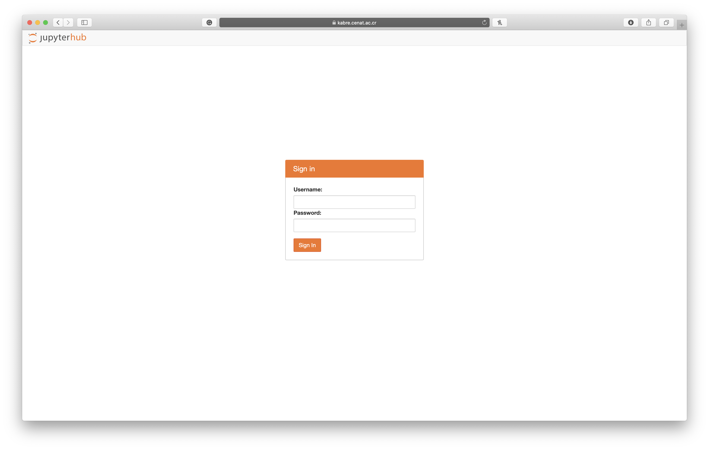
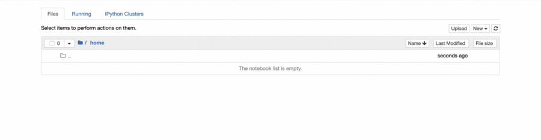
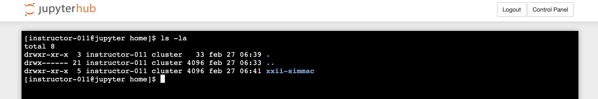

# Getting Started

Hey, thanks for the interest on this tutorial! Hopefully, after the tutorial, you will have a basic idea of the *tricks* behind parallel computing with __R__. 

For starters, I would like you to become familiar with the working environment.

1.  Navigate to https://kabre.cenat.ac.cr:8000

    
    
2. Use the provided access information (check your email)

3. Welcome to *the matrix* 🥳

4. But first, we need to *copy* some data to your environment.
    - Click on *New*
    - Choose *Terminal*
  
    

5. The *Terminal* is how you can interact with KABRÉ's *head* nodes, if you are familiar with Linux and/or macOS, this is pretty much the same, Windows users, no need to panic 😅, we won't be using the terminal too long 😁.

6. Seriously, I just need you to execute the following command inside the terminal:
    ```bash
    git clone https://github.com/villegar/xxii-simmac.git
    ```

    This will download inside your working directory (aka *home* 🏠) all the files that we will be using during this tutorial.

7. Execute the following command:
    ```bash
    ls -la
    ```

    You should be able to see something similar to:
    
    
    
8. You are done! ✅ Thanks for your time.
