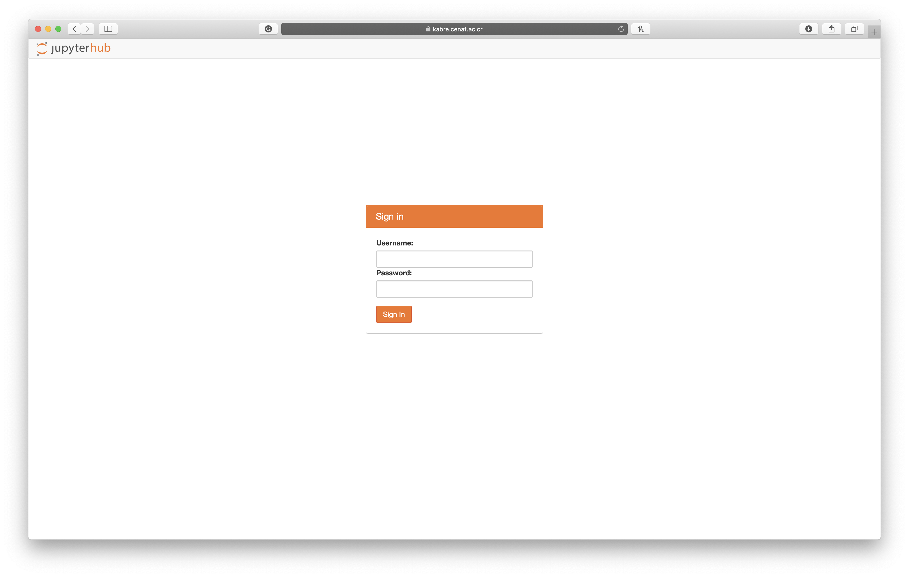

# Before the Tutorial

The day has finally arrived, it is showtime! 🤓

But first, some housekeeping before diving into the amazing world of HPC! Yesterday (hopefully), you got an email with some information about [Getting Started](0.GettingStarted.md), if you haven't had time to have a look, please do so, before we can move on.

Now, I just need you to do one more thing, download the latest version of the files we will be using during the tutorial. Follow the instructions below:

1. Navigate to https://kabre.cenat.ac.cr:8000

    
    
2. Use the provided access information (check your email)

3. Open a new *Terminal*
    - Click on *New*
    - Choose *Terminal*
  
    

4. Run the following command to *change directory* (_`cd`_) 
    ```bash
    cd xxii-simmac
    ```
    
5. Download the latest version of the files with the following command:
    ```bash
    git pull
    ```
