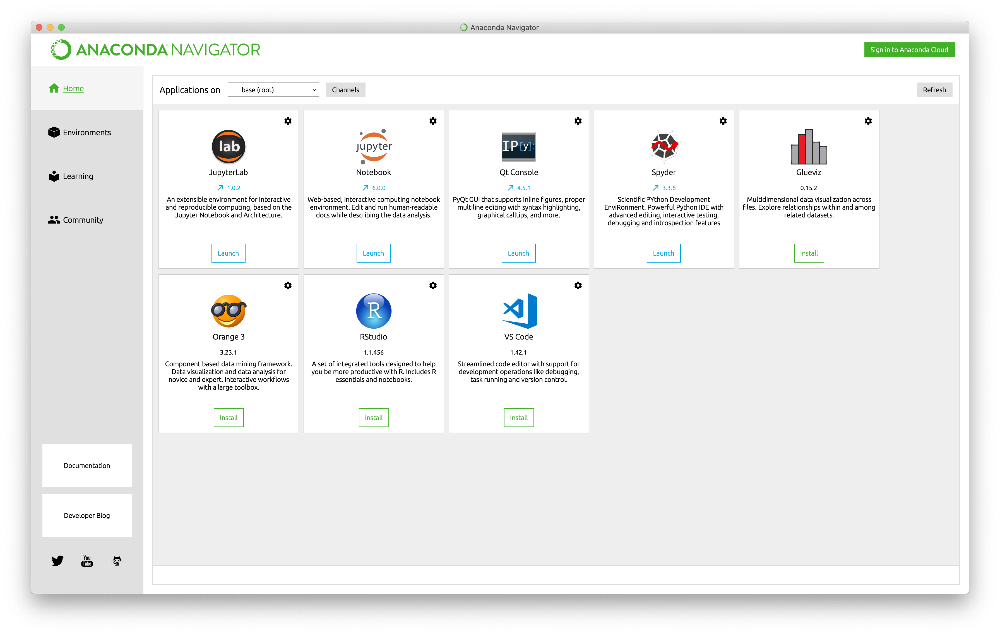
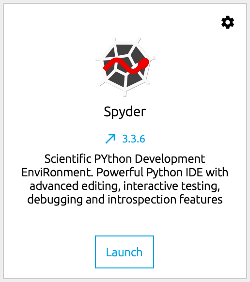
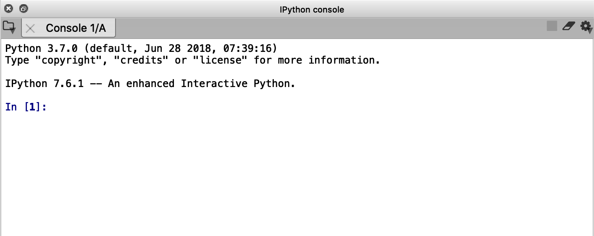

# Installing Anaconda

If you are afraid of snakes 🐍, there is no need to worry, Anaconda is going to be your best mate. What a wonderful time to be alive ☺️

Let's start by installing Anaconda:
1. Download the appropriate version for your operating system from https://www.anaconda.com/distribution/
    - I recommend downloading the version for Python 3.7 as 2.7 is not (officially) supported anymore ☹️ 
2. Read the 765072057 pages of *user agreement terms and conditions* and _Accept_ them (you have no choice) 😎
3. Then, click on any *Next* button you see.
4. You are done.

# Setting up the workspace
Next, we are going to create a virtual environment (think of a box 📦 where you keep your tools 🧰) with Anaconda. 
1. Open Anaconda Navigator

    
    
2. Launch an instance of Spyder (click on Launch)
    
    

    Somewhere (ideally on the bottom right corner), you will see a window called _IPython console_ similar to one shown below:
     
    

3. Execute the following (line by line please) commands:

    ```bash
    conda create -n SIMMAC # Create a virtual environment called SIMMAC
    source activate SIMMAC # Activate the virtual environment

    pip install git+https://github.com/NERSC/slurm-magic.git # Only for HPC environments
    
    # Install Python and R packages
    conda install -c conda-forge ipyslurm -y
    conda install -c anaconda pandas -y
    conda install -c r r-irkernel -y
    conda install -c conda-forge jupyter -y
    conda install -c conda-forge r-rmpi -y
    conda install -c r r-doparallel -y
    conda install -c r r-foreach -y
    conda install -c r r-dompi -y
    conda install -c r r-tictoc -y
    ```
